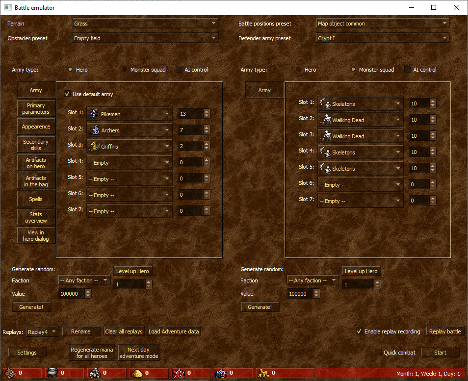
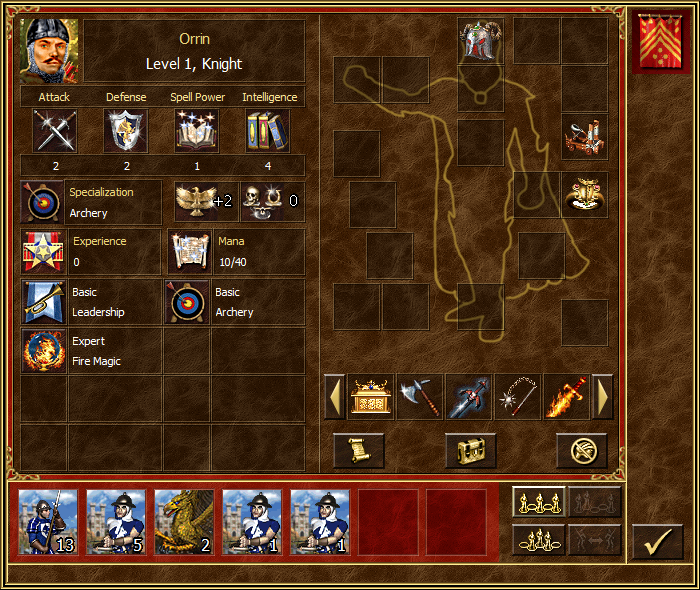
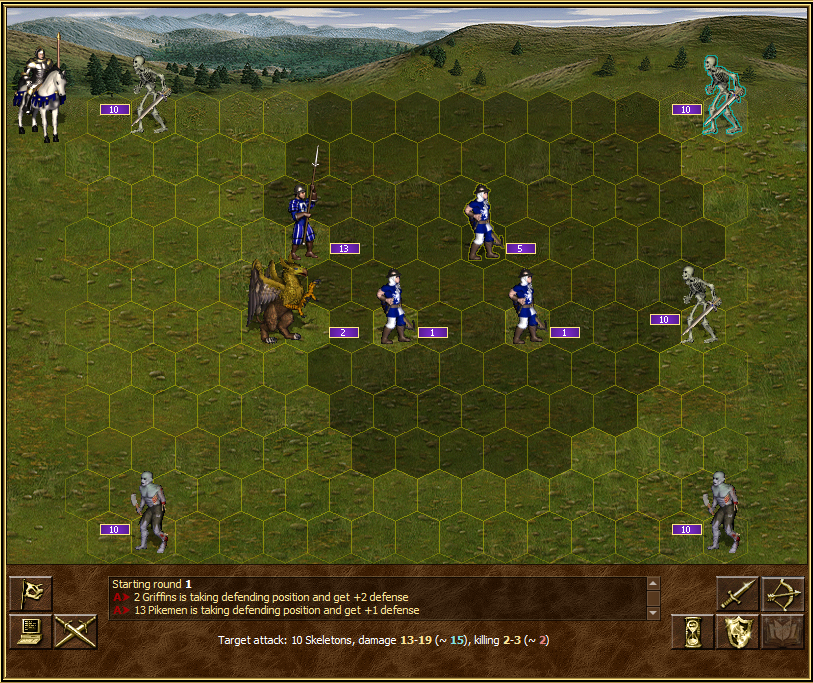

**Этот же документ - [версия на русском языке, идти сюда!](README_RU.md)**

# FreeHeroes
FreeHeroes is free (both "as free beer" and "as free speech") engine for Heroes of Might and Magic 3, similar to [VCMI project](https://vcmi.eu).  
Project goals are:  
1. Develop a free engine which could provide HotA + HD Mod functionality
2. Go even further and provide moder cybersport features: replays, observer mod, cheater-proof online server, etc
3. To be at least as flexible as VCMI is in terms of modding.

FreeHeroes is an executable file, which could run without original Heroes III data. But, for eye pleasant, it's better to have original resources, and FreeHeroes provide converter for legacy data. Conversion is done one time, after that original game resources no more needed (SoD/HotA/HD).

**Current state**: project in **early development (!)**; adventure mode is unavailable - only battles in some subset of features are possible.

To read more about project goals; "why not contributing to VCMI"; road map; "how you interact with HotA" - [read this article](docs/en/ProjectGoals.md)

# How to run
1. download 7z archive  from releases page: https://github.com/mapron/FreeHeroes/releases  (take last available FreeHeroes_Win64_*.7z  file )
2. extract it ([7 zip extractor is required](https://www.7-zip.org/))
3. run LegacyConverter.exe, press "convert!" button
4. after conversion is finished, you could start BattleEmulator and press "start battle" button.  

For more documentation how to use battle emulation, [read this article](docs/en/BattleEmulator.md)

# How it looks like

# If something goes wrong
... you are useng pre-alpha version! Jokes away, you can create and issue here https://github.com/mapron/FreeHeroes/issues  
It is important not only to describe the problem, but also attach logs and replay if available.  
Logs are stored at %USER%\AppData\Local\FreeHeroes\Logs  (for example, C:\Users\mapron\AppData\Local\FreeHeroes\Logs for me) on Windows.  
Replays in adjacent folder, %USER%\AppData\Local\FreeHeroes\Replays.  
Attaching a replay file very handy when describing some battle logic bug (especially AI bug).  

# How to build from the source
Prerequisites:
1. **Qt 5.15 LTS** (potentially with some patches could compile with Qt 5.13. Prior version - definitely impossible)
2. **CMake 3.18**  (prior version should be fine though, but for C++20 support some manual flags tuning is required).
3. **C++20 capable compiler** (note: no full support is needed). Tested: GCC 10, Clang 10, MSVC 2019 16.6.  

If requirements are met, then go "cmake/build/build install". For windows platform, "build install" creates install in binary directory with all runtime dependencies.

Optional dependency: **FFMpeg** with **webm encoder support**. FFMpeg required to convert audio and video resources. You could provide it through "FFMPEG_BINARY" cmake option for convenience (it does not affect the build).

# Contribution
Project is in active developemnt, so I don't expect patches (Yeah, I could not say "patches are welcome" yet), but I won't deny them too. Just keep in mind any fix could potentially conflict with my plans to htow away half of the project. For reading and understanding the code, design desisions, and answers "why it had done such way", [read an article for contribution](docs/en/Contribute.md)

# License
Project source code is licensed under [MIT license](LICENSE).
Project resouces (Images and Audio data) are licensed under [Attribution-ShareAlike 4.0 International CC BY-SA 4.0](https://creativecommons.org/licenses/by-sa/4.0/) license.

# Third party components distributed as part of the project
1. Googletest, https://github.com/google/googletest, [ BSD-3-Clause License ](https://github.com/google/googletest/blob/master/LICENSE)
2. Lua interpreter, https://www.lua.org/ , [MIT License](https://www.lua.org/license.html)
3. nlohmann json, https://github.com/nlohmann/json, [MIT License](https://github.com/nlohmann/json/blob/develop/LICENSE.MIT)
4. RTTR, https://github.com/rttrorg/rttr, [MIT License](https://github.com/rttrorg/rttr/blob/master/LICENSE.txt)
5. SOL, https://github.com/ThePhD/sol2, [MIT License](https://github.com/ThePhD/sol2/blob/develop/LICENSE.txt)
6. ZLib, https://github.com/madler/zlib, [ZLib license](https://opensource.org/licenses/Zlib)  

All of these are permissive and compatible with MIT.

# Third party components as non-distributed dependency
1. Qt , https://www.qt.io/, GPL/LGPL/Commercial; components utilized by FreeHeroes available under LGPL.
2. FFMpeg https://ffmpeg.org, LGPL
3. Webm (as part of ffmpeg binary), https://github.com/webmproject/libwebp/, [3-Clause BSD](https://github.com/webmproject/libwebp/blob/master/COPYING)

Keep this in mind if you decide to create closed source derivative work.
