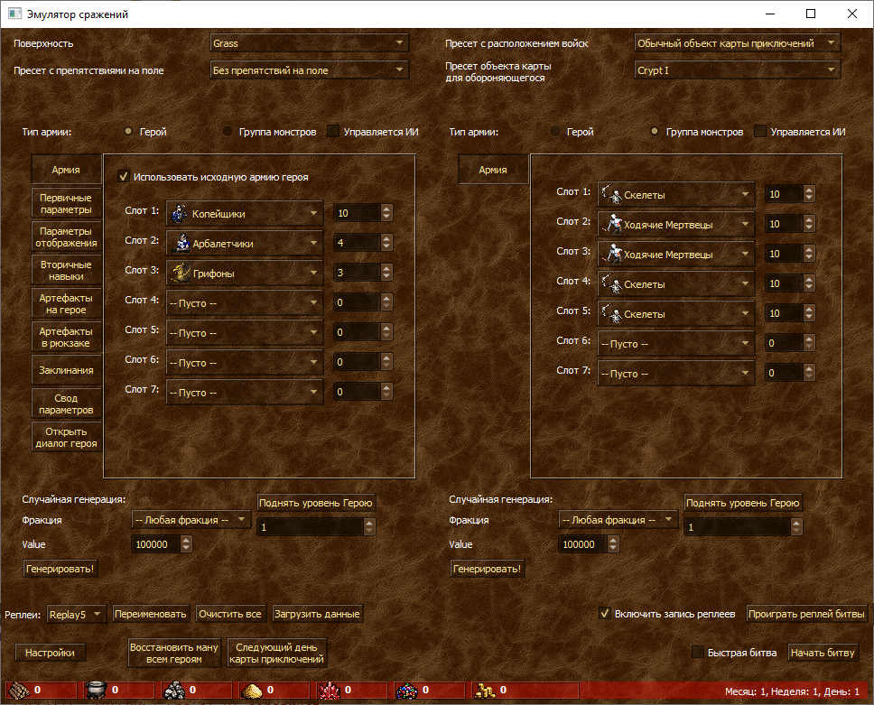
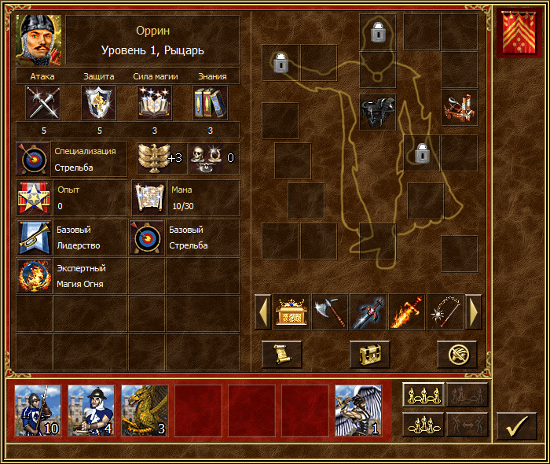
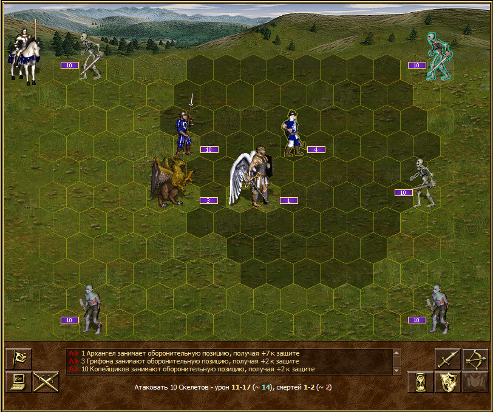

**This document is available [in English version, follow this link!](README.md)**

# FreeHeroes
FreeHeroes - свободный (и бесплатный) движок для игры Heroes of Might and Magic 3, во многом схожий с [проектом VCMI](https://vcmi.eu).  
Цели проекта:  
1. Разработка свободного движка, который примерно повторит функциональность HotA + HD Mod;
2. Пойти дальше и предоставить современный киберспортивные фичи, такие как реплеи, режим наблюдателя, онлайн игра без мапхаков и тп.
3. Быть как минимум таким же гибким в плане моддинга, как и VCMI.

FreeHeroes - это исполняемый файл (exe), который может запускаться без оригинальной игры (Heroes III SoD/HotA), и даже без её данных. Конечно, с картинками заглушками игра приятной быть не может, поэтому сильно рекомендуется воспользоваться конвертером оригинальных ресурсов, который идет с движком. После конвертации ресурсов, оригинальные файлы для движка не требуются. Разумеется, вы должны быть полноправным обладателем лицензионной копии игры.

**Текущее состояние**: проект в **ну очень ранней разработке(!)**; режима приключений нет, "играть" как полагается в игру - нельзя. Можно эксперементировать в режиме эмуляции сражений, "брать" объекты и тп.

Чтобы почитать больше о целях проекта; "почему не VCMI"; план на ближайшие релизы; "как вы взаимодействуете с HotA" - [читаем план развития](docs/ru/ProjectGoals.md)

# Как запускать
1. скачиваем 7z архив  отсюда: https://github.com/mapron/FreeHeroes/releases  (выбираем последнюю доступную сборку FreeHeroes_Win64_*.7z )
2. распаковываем([7-zip программа для распаковки](https://www.7-zip.org/))
3. запускаем LegacyConverter.exe, жмём "Конвертировать!"
4. немного ждем, как конвертация закончится, можно запускать BattleEmulator.exe и нажать "Начать битву!"  

Для более подробного опиания что умеет Эмулятор, [читаем статью](docs/ru/BattleEmulator.md)

# Как оно выглядит
  
Главное окно эмулятора;  
  
Диалог героя  
  
Процесс сражения

# Если что-то пошло не так
... ну вы же используете пре-альфа версию! Если без шуток, напишите мне либо заведите Issue здесь: https://github.com/mapron/FreeHeroes/issues  
Кроме подробно объяснения проблемы, важно предоставить логи и реплеи, если они есть.  
Логи хранятся %USER%\AppData\Local\FreeHeroes\Logs  (например, C:\Users\mapron\AppData\Local\FreeHeroes\Logs для меня) на платформе Windows.  
Реплеи в соседней директории, %USER%\AppData\Local\FreeHeroes\Replays.  
Прикрепление реплея крайне важно для отчетов от ошибках в боевой логике (а также ИИ).  

# Как собирать из исходников
Требования:
1. **Qt 5.15 LTS** (с небольшими патчами может собраться и с Qt 5.13, но точно не раньше)
2. **CMake 3.18**  (можно и более ранние версии, но нужны будут выставления флагов для C++20 вручную).
3. **C++20 компилятор** (полная поддержка C++20 не требуется). Проверены: GCC 10, Clang 10, MSVC 2019 16.6.  

Просто запускаем "cmake/build/build install". Для Windows команда "build install" создает в сборочной директории каталог "install" со всеми необходимыми рантайм зависимостями (можно запускать на другой машине)

Опциональная зависимость: **FFMpeg** с **webm енкодером**. FFMpeg нужен для конвертации аудио/видео ресурсов. Можно выставить переменную CMake "FFMPEG_BINARY" для удобства установки (на сборку не влияет).

# Вклад в проект 
Проект в активной разработке, и патчей я особо не жду (хотя и не отвергаю). Просто имейте в виду что ваши патчи могут войти в конфликт с моими планами выкинуть половину файлов проекта. Однако же, для чтения и понимания кода, принятых решений можно [почитать док для контрибьюторов](docs/ru/Contribute.md)

# Лицензия
Исходный код под [лицензией MIT](LICENSE).
Ресурсы движка (изображения и аудио) под [Attribution-ShareAlike 4.0 International CC BY-SA 4.0](https://creativecommons.org/licenses/by-sa/4.0/) лицензией.

# Стороннее ПО, поставляемое вместе с исходным кодом проекта:
1. Googletest, https://github.com/google/googletest, [ BSD-3-Clause License ](https://github.com/google/googletest/blob/master/LICENSE)
2. Lua interpreter, https://www.lua.org/ , [MIT License](https://www.lua.org/license.html)
3. nlohmann json, https://github.com/nlohmann/json, [MIT License](https://github.com/nlohmann/json/blob/develop/LICENSE.MIT)
4. RTTR, https://github.com/rttrorg/rttr, [MIT License](https://github.com/rttrorg/rttr/blob/master/LICENSE.txt)
5. SOL, https://github.com/ThePhD/sol2, [MIT License](https://github.com/ThePhD/sol2/blob/develop/LICENSE.txt)
6. ZLib, https://github.com/madler/zlib, [ZLib license](https://opensource.org/licenses/Zlib)  

Все проекты поставляются под пермиссивными лицензиями, совместимыми с MIT.

# Стороннее ПО, используемое как зависимости
1. Qt , https://www.qt.io/, GPL/LGPL/Commercial; те модули, которые использует FreeHeroes - доступны под LGPL лиценизией.
2. FFMpeg https://ffmpeg.org, LGPL
3. Webm (как часть FFMpeg), https://github.com/webmproject/libwebp/, [3-Clause BSD](https://github.com/webmproject/libwebp/blob/master/COPYING)

Примите информацию к сведению в случае разработки производной работы с закрытым исходным кодом. 
