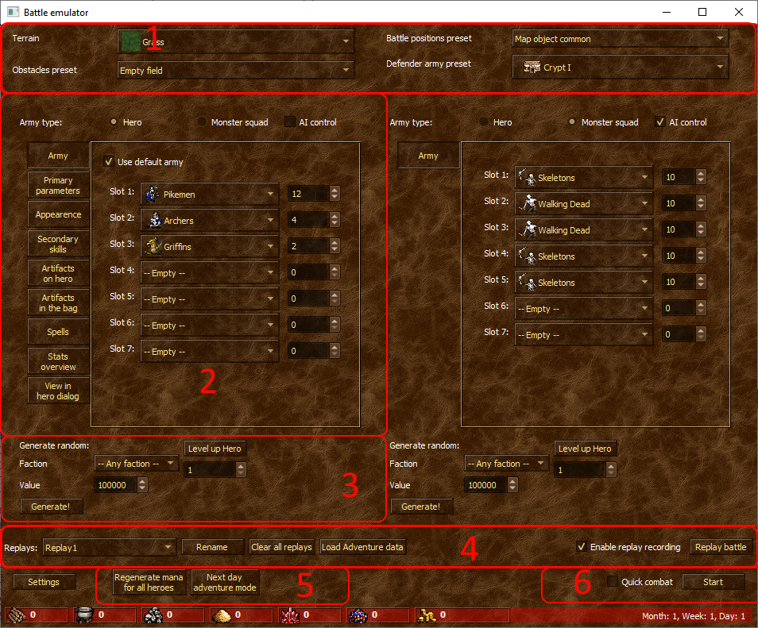

# Features of Battle Emulator

Emulator interface

1. Top part of the window - allows you to set up the "environment" for the battle. "Surface" - the land on which the battle takes place. Affects the speed of creatures (like native) + visual background. Obstacle preset - t. random obstacles are not yet implemented, allows you to select a preset with obstacles (one of 5). By default, there are no obstacles on the field. "Troop placement" changes the placement of troops under the creature bank. Finally, you can select a creature bank preset with ready-made guards (it also affects the received reward).
2. Below, there are two identical zones - configuring the attacking and defending sides. They look different in the screenshot, because one army has the type "with a hero" selected, and for the other - just a group of monsters. In this configurator you can:
- set the composition of the army
- choose a hero
- set primary parameters to it
- set the artifacts that the hero has, his skills and spells written in the book
- finally, watch all this in the dialogue of the hero, which almost repeats the dialogue of the hero of the original game.
3. Below, under the army configurator, there are 2 auxiliary features for testing - generating a random army (the total value is indicated) and raising the level of the hero (as if he took experience in the game). Editing experience in the main editor does not change the stats and skills of the hero.
4. Panel replays of the game. Allows you to load existing ones (works like loading a save game before a battle), as well as record a new one (recording is usually enabled). "Play replay" enables "view-only" battle mode. Step-by-step preview and rewind will be available.
5. two more auxiliary buttons for testing, which already affect both armies - the replenishment of mana for all heroes, as well as the "next day", to check Mysticism and income in resources.
6. Start battle - starts the battle as if one army attacked another. If you check the "fast battle" checkbox, then an auto battle will take place (though without the ability to replay it right away - just press cancel and uncheck the fast battle checkbox).